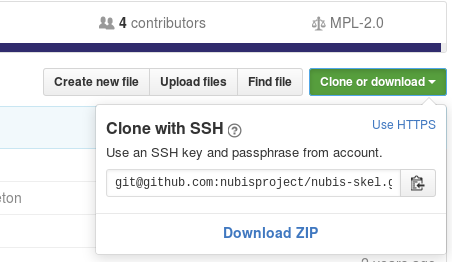
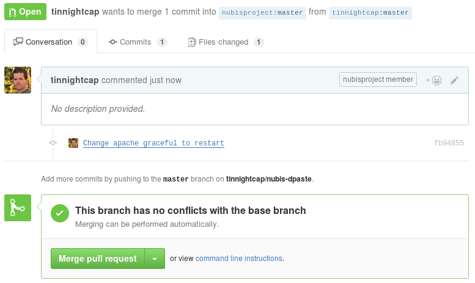



# Nubis-Dpaste Working Lab

In this lab we will walk through cloning the nubis-dpaste repository, making a
change and submitting a pull request.

## Fork The nubis-dpaste Repository On GitHub

Head over the the [nubis-dpaste](https://github.com/Nubisproject/nubis-dpaste)
repository on GitHub and click the fork button.


## Clone The Repository Locally

Next we will clone the repository locally. You can copy the url from github and
paste it into your terminal.



```bash

git clone git@github.com:nubisproject/nubis-dpaste.git
cd nubis-dpaste

```

## Make some local changes

Here we will make a local change. Lets say that the ```apache2ctl graceful```
command is not sufficent to apply our changes. Lets change that
to ```apache2ctl restart```.

```bash

vi nubis/puppet/files/update

```

Change ```apache2ctl graceful```


To ```apache2ctl restart```


## Make a Pull Request

Now we want to get our changes accepted upstream so we can get this change into
production. We will use a series of git commands to check in our change and
submit a pull request.

### Git stauts

Lets check the changes that git is aware of.

```bash

git status

```


### Git diff

If we would like to double check that we are not including anything unintended
in the commit we can look at the diff.

```bash

git diff

```


### Git add

The next step is to add the changes we want to include.

```bash

git add nubis/puppet/files/update

```

### Git status

Lets double check what git is going to include in our commit. We can see here
that git is only going to include the change we made in this commit.

```bash

git status

```


### Git commit

Now that we have added the changed file and verified what we are committing it
is time to commit the changes. While it is possible to add a message to the
commit command, I encourage you to always add the message through your editor
as it gives you one last chance to ensure you are committing what you intended.

Go ahead and add a good commit message like ```Change apache graceful to restart```

```bash

git commit

```


### Git push

Finally it is time to push our local commit to our remote repository. Since we
cloned this from our user space on GitHub this will push our changes to the
repository hosted there.

```bash

git push

```


### Create a Pull Request

Now we can head over to GitHub and make a pull request.

#### Load GitHub in your browser

Start by going to your ```nubis-dpaste``` repository on GitHub. For me the url
is [https://github.com/$GIT_USERNAME/nubis-dpaste](https://github.com/$GIT_USERNAME/nubis-dpaste),
however you will need to change ```$GIT_USERNAME``` to your GitHub user name.

#### GitHub New Pull Request

Click on the ```New Pull Request``` button.


#### GitHub Create Pull Request

This is your final change to review your changes before creating the pull
request. You can review all of the changes to all of the files that are going to
be included. Once you have ensured that everything looks good, go ahead and
click on the ```Create Pull Request``` button.


### Code Review

Once that is complete, anyone with admin privileges on the original repository
will be able to merge your pull request. At this point they may; make comments
and ask you to make changes, reject the pull request, or simply ```r+``` and
merge in your changes.



## Clean up

Since this is just an example and we do not want to actually make this change,
lets go ahead and reset to a clean state.

This will reset your repository to the state it was in before the last commit.
If you wish to remove the commit but leave the changed files in
a ```"Changes to be committed"``` state you can use the ```--soft``` option in
place of ```--hard```. The ```HEAD~1``` portion tells git to go back one commit
from the tip of the repository.

```bash

git reset --hard HEAD~1

```

Finally, go ahead and push this up to your fork on GitHub.

**NOTE:** You do not want to normally remove commits from a public repository.
This is especially important if anyone has forked your repository. In this case
it should be safe since no one should have forked your repository yet.
**Use Caution**

```bash

git push -f

```

## FIN

That is the end of this lab. If you have any questions do not hesitate to reach
out to us on ```irc.mozilla.org #nubis-users```.
