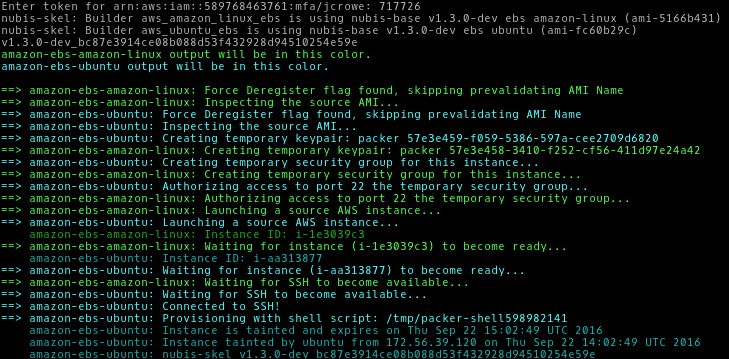
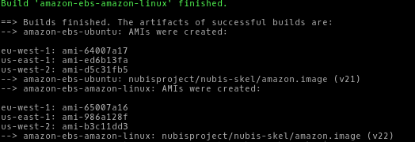
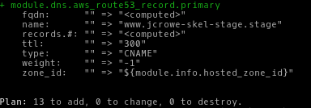
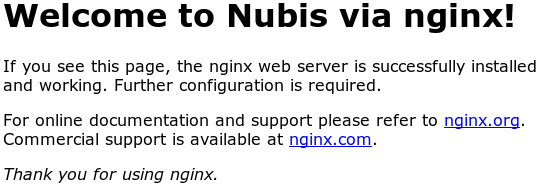
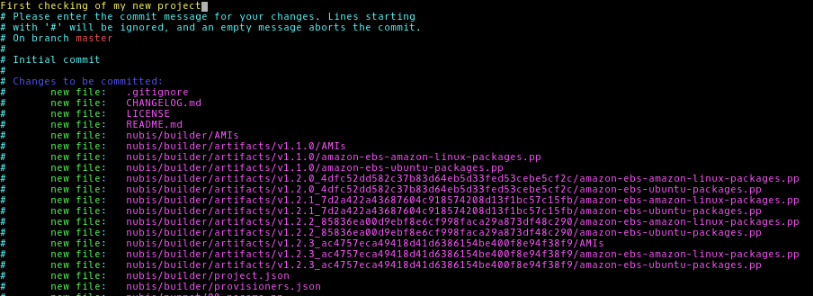
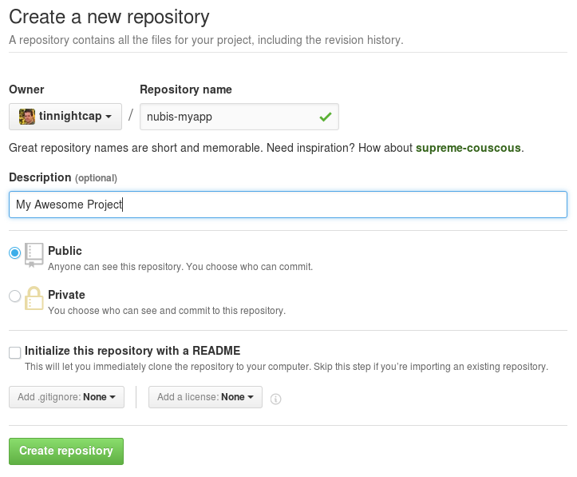

# Nubis-Skel Working Lab
In this lab we will walk through obtaining a release from the nubis-skel repository, building an AMI and deploying it into AWS. We will then modify the application code, rebuilding and redeploying the application.

## Get the code
Next grab the latest [release](https://github.com/nubisproject/nubis-skel/releases/latest), extract it and copy the *nubis* directory into your code base.

```bash
wget https://github.com/nubisproject/nubis-skel/archive/v1.2.2-training.tar.gz
tar -xvf v1.2.2-training.tar.gz
cd nubis-skel-1.2.2-training/
```
## Change the name of the application
Here we will change the name of the application. When you are deploying your own application you should change this to what makes sense. For the sake of this lab, you should use some form of your user name.

**NOTE** Do not use ```myapp``` here, it will cause a build error

**NOTE2** Do not exceed 12 characters for the app name (ask me why if you are interested)

```bash
grep skel * -rl | xargs perl -pi -e's/skel/myapp/g'
```

## Build The Application AMI
It is time to build a new AMI. We will use [nubis-builder](https://github.com/Nubisproject/nubis-builder) to do this. You should already have installed nubis-builder by following the instructions in the [prerequisites](https://github.com/Nubisproject/nubis-docs/blob/master/PREREQUISITES.md) document.

```
nubis-builder build
```

You should see something like this:



### Capture The AMI ID
You will need to record the AMI ID for ubuntu in us-west-2 from the nubis-builder outputs.

In this example that would be ```us-west-2: ami-d5c31fb5```, however your AMI ID will be different.



## Deploy With Terraform
Now that we have built the AMI we can use it to deploy into AWS using Terraform. Again this tool should have been installed by following the [prerequisites](https://github.com/Nubisproject/nubis-docs/blob/master/PREREQUISITES.md) document.

All of the terraform commands should be run from the ```nubis/terraform``` directory. We will also set some variables for convenience.

**NOTE:** If your POSIX login is different from your local user name you may need to replace the ```$USER``` variables below with your POSIX user name. Do not use your entire LDAP login here. Say your LDAP is ```me@mozilla.com```, you would use ```me```.

**NOTE-2:** You need to use the AMI ID from the ```nubis-builder``` outputs to include it in the ```AMI_ID``` variable here.

**NOTE-3:** Make sure to edit ```SSH_KEY_FILE``` to point to a valid ssh public key.

```bash
cd nubis/terraform
export ACCOUNT_NAME="nubis-training-2016" USER_LOGIN="$USER" SSH_KEY_NAME="$USER-skel" SSH_KEY_FILE="~/.ssh/XXX.pub" AMI_ID="ami-XXX"
```

## Configure The Deployment
In this step we will create our ```terraform.tfvars``` file. There is an example ```terraform.tfvars-dist``` file that you can copy and edit or you can run the following commands.

**NOTE:** For all of the copy-paste examples, some users have reported having to remove the curly brackets ```{ }```.

```bash
cat <<EOF > terraform.tfvars
account = "${ACCOUNT_NAME}"
region  = "us-west-2"
environment = "stage"
service_name = "${USER_LOGIN}"
ssh_key_name = "${SSH_KEY_NAME}"
ssh_key_file = "${SSH_KEY_FILE}"
EOF

```

### Get Terraform Modules
The first step will be to grab the terraform modules that we use to deploy the application.

```bash
terraform get -update=true
```

You should see something like this:


### Plan The Deployment
Next we will run a ```terraform plan```. This will show us all of the resources that we are about to create in AWS.  We will be using the aws-vault tool which you installed and configured when following the instructions in the [prerequisites](https://github.com/Nubisproject/nubis-docs/blob/master/PREREQUISITES.md) document.

```bash
aws-vault exec ${ACCOUNT_NAME}-admin -- terraform plan -var ami=${AMI_ID}
```

You should see something like this:



### Apply the deployment
Finally it is time to deploy our application into AWS. We do that by running a ```terraform apply```.

```bash
aws-vault exec ${ACCOUNT_NAME}-admin -- terraform apply -var ami=${AMI_ID}
```

You should see something like this:


If you get an error similar to this one you will need to edit yout ```terraform.tfvars``` file and shorten the ```service_name```.

```bash
* aws_elb.load_balancer: "name" cannot be longer than 32 characters: "longusername-myapp-stage-us-west-2-elb"
```

### Verify it worked
Load the ```address``` from the ```Outputs:``` you got during the ```terraform apply``` above and you should see the nginx default ```index.html``` page.

<kbd></kbd>

## Update The Application
Now we are going to make a change to the application. You can customize the application to your liking. The commands here will have you simply edit the ```index.html``` file and add some custom text. Then you will rebuild the AMI by running ```nubis-builder build```, thereafter a ```terraform plan``` followed by a ```terraform apply```.

**NOTE:** Remember to use the new AMI ID from the ```nubis-builder``` outputs and include it in the ```AMI_ID``` variable here.

```bash
cd ../.. # You should be in the root nubis-skel directory here
vi nubis/puppet/files/index.html # <--- Make awesome changes
nubis-builder build
export AMI_ID="ami-XXX"
( cd nubis/terraform && aws-vault exec ${ACCOUNT_NAME}-admin -- terraform plan -var ami=${AMI_ID} )
( cd nubis/terraform && aws-vault exec ${ACCOUNT_NAME}-admin -- terraform apply -var ami=${AMI_ID} )
```

### Verify your changes
Load the ```address``` from the ```Outputs:``` you got during the ```terraform apply``` above and you should see your updates to the ```index.html``` page.

<kbd></kbd>

### Logging on to your instance
The web server that we deployed is runnign in a private subnet. In order to ssh to the web server we will need to go through a jumphost.  Replace "myapp" in this command with your app name.

```bash
ssh -A -t ec2-user@jumphost.stage.us-west-2.${ACCOUNT_NAME}.nubis.allizom.org "ssh -A -t ubuntu@${USER_LOGIN}.nubis-myapp.service.consul"
```

### Loggin into the AWS web console.
If you need to get into the web console you can do that with the aws-vault command.

```bash
aws-vault login nubis-training-2016-ro
```


## Create your own repository
Now we will walk through creating your own repository onGitHub. This will enable you to collaborate with other s using the workflow we discovered in the [previous lab](nubis_dpaste.md).

### Initialize the repository
The first step is to initialize the repository.

```bash
git init
```
You should see:
```bash
Initialized empty Git repository in ~/nubis-skel-1.2.2-training/.git/
```

Next lets add all of the files:
```bash
git add .
```
Now we need to commit our (new) changes:
```bash
git commit
```

Add a nice commit message like ```First checking of my new project```



### Create a new repository on GitHub
You need to be logged into GitHub for these steps. If you are not already logged in head over to [GitHub](https://github.com) and login.

Next create a new repository [here](https://github.com/new)

You will need to name your new repository and add a description. You do not need to add a README or a LICENSE as they are already included with the nubis-skel project. then click the ```“Create repository”``` button.

<kbd></kbd>

Now you will need follow the second set of instructions under ```“Push an existing repository…”```.

```bash
git remote add origin git@github.com:username/new_repo
git push -u origin master
```


## Clean Up The Deployment
Lastly, we should clean up our deployment. In AWS everything costs money. Add onto that the fact that when using terraform it is quick to start up and shut down your deployment. It just makes sense to shut them down at the end of the day.

```bash
cd nubis/terraform
aws-vault exec ${ACCOUNT_NAME}-admin -- terraform plan -var ami=${AMI_ID} -destroy
aws-vault exec ${ACCOUNT_NAME}-admin -- terraform destroy -var ami=${AMI_ID}
```

You should see something like this:


## About the AMI ID
As a final note. You can place the AMI ID into the ```terraform.tfvars``` file if that fits your work-flow. ```ami = "ami-xxx"```. In that case you can omit the ```-var ami=${AMI_ID}``` portion from all of the commands above. Just know that you will need to update it every time you rebuild the AMI.

In fact all of the variables in the ```terraform.tfvars``` file can be either replaced or overridden in this way.

## FIN
Well that is it for this working lab. I hope you had fun and learned a bit about deploying into AWS using Nubis. As always if you have questions feel free to reach out to us at nubis-users@googlegroups.com or find us on ```irc.mozilla.org #nubis-users```.

Thanks for playing.
